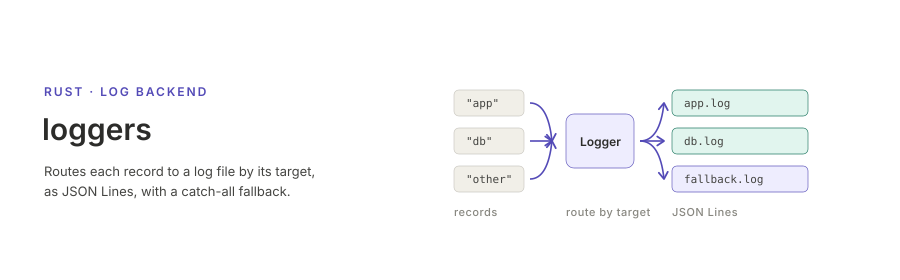

<p align="center"></p>

**English** | [日本語](README.ja.md)

[](https://github.com/akitenkrad/rs-loggers/actions/workflows/ci.yml)
[](https://crates.io/crates/loggers)
[](https://docs.rs/loggers)

# loggers

A small [`log`](https://crates.io/crates/log) backend that routes each record to
a log file chosen by its target, with an optional catch-all fallback for the
records no logger claims. Records are appended as JSON Lines and echoed to
stdout in a human-readable form.

## Installation

```bash
cargo add loggers
```

## Quick start

```rust
use log::{debug, info};
use loggers::*;

let mut logger = Logger::new();

// Records targeting "test" go to system.log.
logger.add_logger(Box::new(CustomLogger::new("test", "tests/output/system.log")));

// Everything else goes to fallback.log.
logger.set_fallback(Box::new(CustomLogger::catch_all("tests/output/fallback.log")));

log::set_boxed_logger(Box::new(logger)).expect("Failed to set logger");
log::set_max_level(log::LevelFilter::Trace);

info!(target: "test", "Hello, world!");
debug!("Default");
```

## Documentation

- [Usage](docs/usage.md) — routing by target, the fallback, output format,
  turning off the stdout echo
- [Behaviour and guarantees](docs/behaviour.md) — what the crate promises, and
  where each promise stops
- [Migrating from 0.1.x](docs/migration.md) — the behaviour changes in 0.2.0
- [Changelog](CHANGELOG.md)
- [API reference](https://docs.rs/loggers) on docs.rs

## License

Apache-2.0
